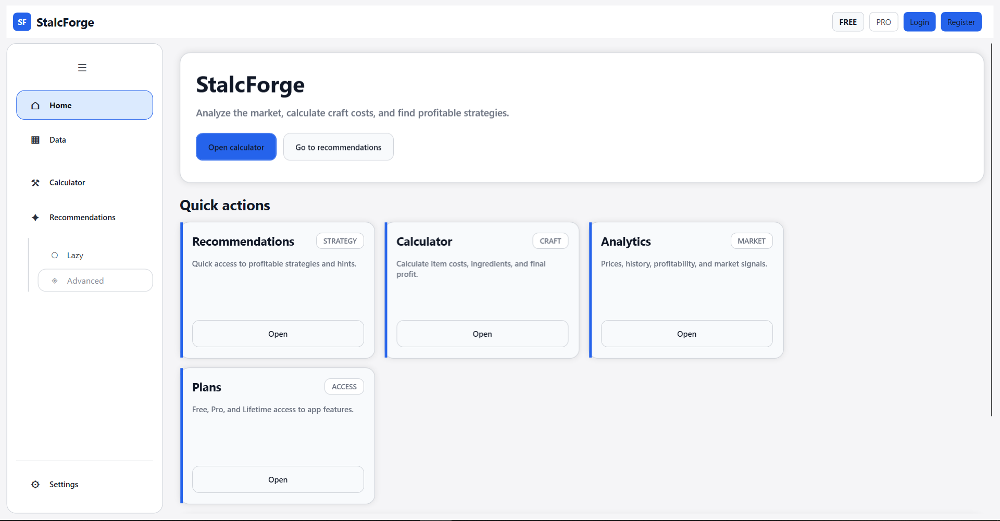
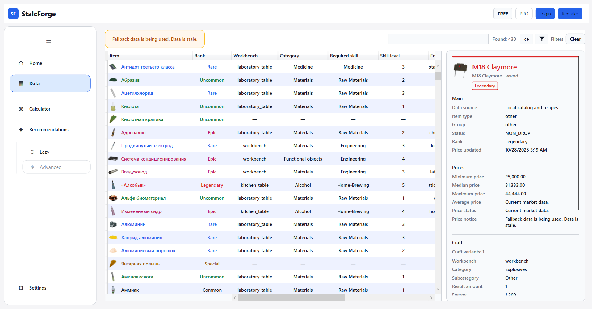
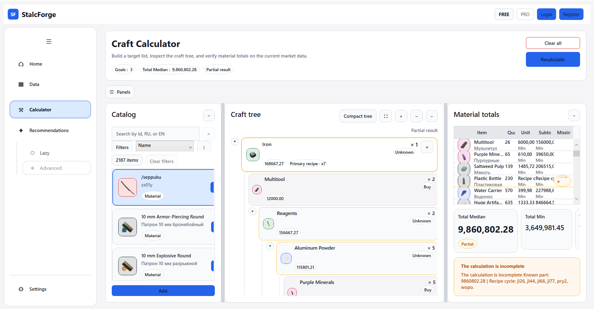
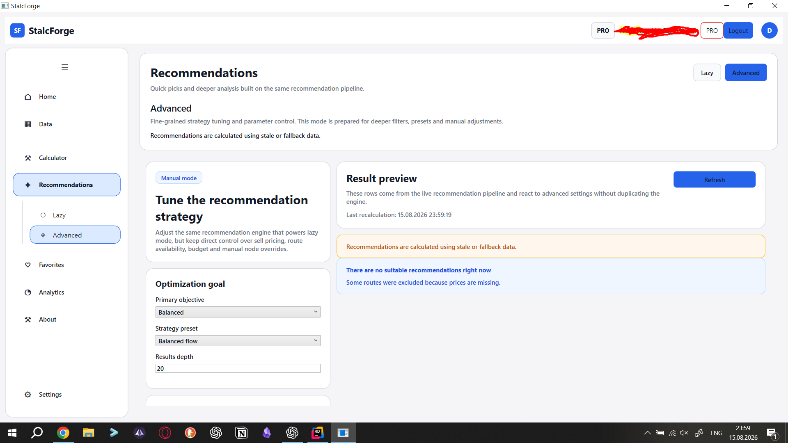
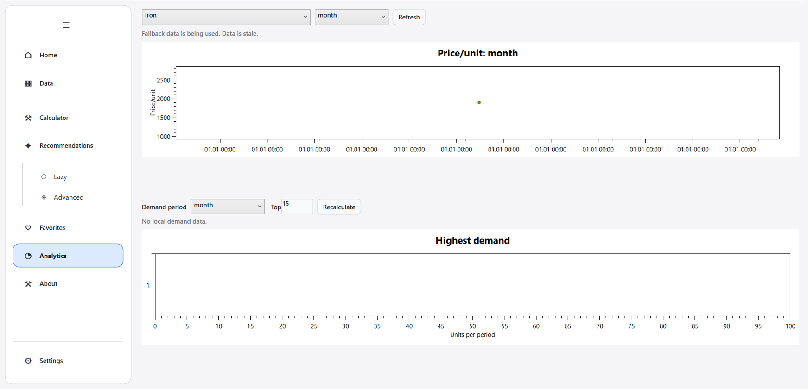
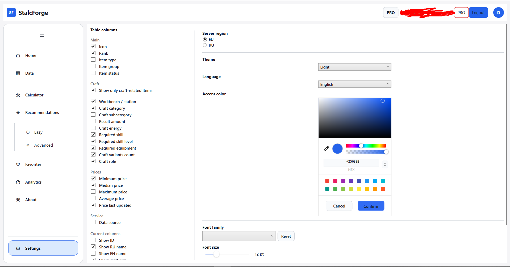

# StalcForge

Market analysis and crafting tools for STALCRAFT players.

> StalcForge is in the final stage of development.  
> The first public release is coming soon.

## What Is StalcForge?

StalcForge helps players make faster and better in-game decisions without digging through raw market listings or doing crafting math by hand.

It is designed as a clean companion tool for tracking item prices, comparing crafting options, and finding useful opportunities across supported regions.

## Main Features

- Market data in a clear and easy-to-read format
- Craft calculator for checking cost and potential value
- Recommendations for better trading and crafting decisions
- Analytics for comparing trends and opportunities
- Favorites for quick access to items you care about
- Support for multiple regions, including EU and RU

## Free and Pro

StalcForge is planned with both Free and Pro access.

### Free

- Core market browsing
- Basic crafting calculations
- Access to essential tools for everyday use

### Pro

- Expanded analytics
- More advanced insights and recommendation tools
- Extra convenience features for active players

The exact plan details may be adjusted before release.

## Screenshots / Demo

The gallery below is ready for the uploaded product screenshots.  
Place the selected images in `docs/images/` with the filenames used here.

### Home

### Market Data

### Craft Calculator

### Recommendations

### Analytics

### Settings

## Release Status

StalcForge is almost ready.

The product is currently being polished for release, with the main user experience and core functionality already defined. This repository is being used as the public landing page until the first release goes live.

## Feedback

If you want to follow the project, keep an eye on this repository for updates and release information.

## Disclaimer

StalcForge is an unofficial companion project for STALCRAFT players and is not affiliated with the game's developers or publishers.

---
# StalcForge

Инструменты для анализа рынка и крафта для игроков STALCRAFT.

> StalcForge находится на финальном этапе разработки.  
> Первый публичный релиз выйдет совсем скоро.

## Что такое StalcForge?

StalcForge помогает игрокам быстрее принимать более выгодные внутриигровые решения: без необходимости вручную изучать списки лотов на рынке или считать стоимость крафта.

Это удобный инструмент для отслеживания цен на предметы, сравнения вариантов крафта и поиска полезных возможностей в поддерживаемых регионах.

## Основные возможности

- Рыночные данные в понятном и удобном для чтения виде
- Калькулятор крафта для расчета стоимости и потенциальной выгоды
- Рекомендации для более эффективных решений в торговле и крафте
- Аналитика для сравнения трендов и возможностей
- Избранное для быстрого доступа к нужным предметам
- Поддержка нескольких регионов, включая EU и RU

## Free и Pro

Для StalcForge планируются тарифы Free и Pro.

### Free

- Просмотр основных рыночных данных
- Базовые расчеты крафта
- Доступ к ключевым инструментам для ежедневного использования

### Pro

- Расширенная аналитика
- Более продвинутые инсайты и инструменты рекомендаций
- Дополнительные функции для активных игроков

Точный состав тарифов может быть скорректирован до релиза.

## Скриншоты / Демонстрация

Галерея ниже подготовлена для скриншотов продукта.  
Поместите выбранные изображения в `docs/images/` с указанными именами файлов.

### Главная

### Рыночные данные

### Калькулятор крафта

### Рекомендации

### Аналитика

### Настройки

## Статус релиза

StalcForge почти готов.

Сейчас продукт проходит финальную полировку перед релизом: основной пользовательский опыт и ключевые возможности уже определены. Этот репозиторий используется как публичная страница проекта до выхода первого релиза.

## Обратная связь

Следите за этим репозиторием, чтобы получать новости о проекте и информацию о релизе.

## Отказ от ответственности

StalcForge - неофициальный проект для игроков STALCRAFT и не связан с разработчиками или издателями игры.

